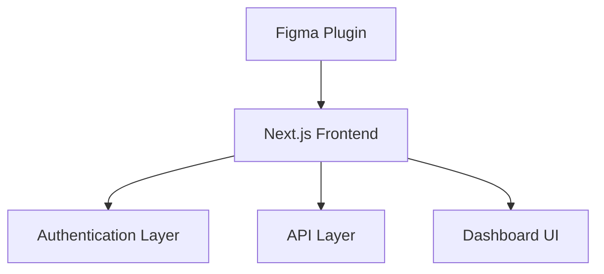
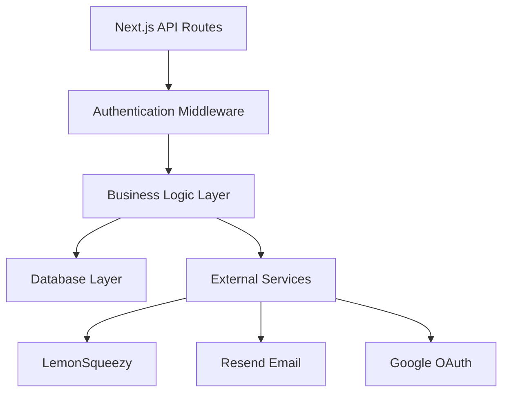
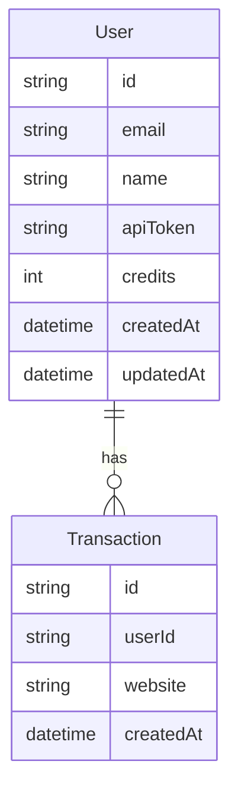
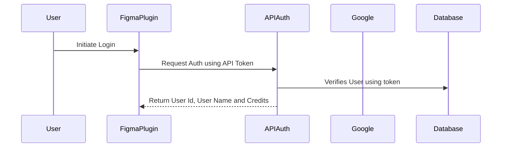
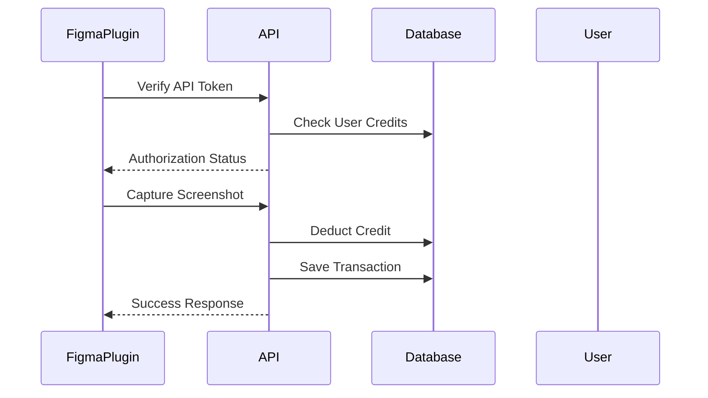

# FigScreen Architecture Documentation

## System Overview

FigScreen is a web application that enables users to capture website screenshots and integrate them directly into Figma projects. The application follows a modern web architecture using Next.js with API routes and integrates with several external services.

## Architecture Components

### 1. Frontend Architecture

#### Key Components:

- **Figma Plugin Interface**: Handles interaction with Figma workspace
- **Dashboard**: User interface for managing profile and credits
- **Authentication UI**: Handles user login/signup via Google OAuth

### 2. Backend Architecture

#### API Layer:

- **Verify API**: Authenticates user tokens for Figma plugin
- **Deduct API**: Manages credit deduction system
- **SaveTransaction API**: Records screenshot transactions

### 3. Database Schema

### 4. Authentication Flow

## External Service Integration

### 1. Payment System (LemonSqueezy)

- Handles payment processing for credits
- Manages subscription variants
- Webhook integration for payment events

### 2. Email Service (Resend)

- Handles authentication emails
- Handles transactional emails
- User notifications
- System alerts

### 3. Authentication (Google OAuth)

- User authentication
- Session management
- Security layer

### Frontend

- Next.js 14+ (App Router)
- React
- Tailwind CSS
- Figma Plugin SDK

### Backend

- Next.js API Routes
- Prisma ORM
- PostgreSQL Database
- NextAuth.js

### Infrastructure

- Environment: Development/Production modes
- Database: PostgreSQL
- API Authentication: Bearer token system
- Email: Resend API
- Payments: LemonSqueezy Integration

## Data Flow

1. **Screenshot Capture Flow**:

## Security Measures

1. **API Security**:

   - Bearer token authentication
   - Rate limiting (recommended)
   - Input validation
   - CORS configuration

2. **Data Security**:
   - Encrypted environment variables
   - Secure database connections
   - Protected API routes

## Scalability Considerations

1. **Database Optimization**:

   - Index on frequent queries
   - Connection pooling
   - Transaction management

2. **Performance**:
   - API response caching
   - Optimized database queries
   - Efficient credit management

## Development Workflow

1. **Local Development**:

   - Environment setup
   - Database migration
   - API testing

2. **Production Deployment**:
   - Build optimization
   - Environment configuration
   - Database synchronization

## Monitoring and Maintenance

1. **System Monitoring**:

   - API endpoint health
   - Database performance
   - User credit tracking

2. **Error Handling**:
   - Structured error responses
   - Transaction logging
   - User notification system

## Future Considerations

1. **Scalability**:

   - Implement caching layer
   - Add rate limiting
   - Optimize database queries

2. **Features**:
   - Batch screenshot processing
   - Advanced screenshot customization